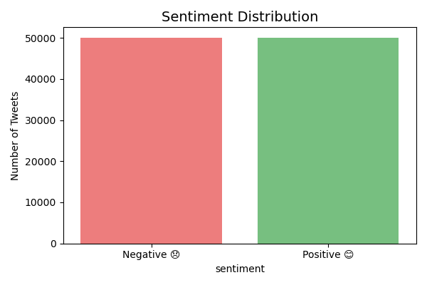
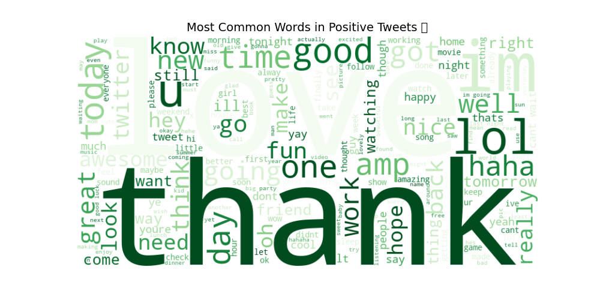
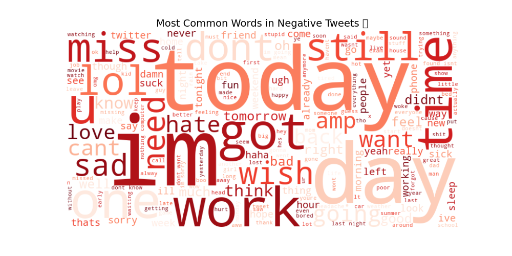
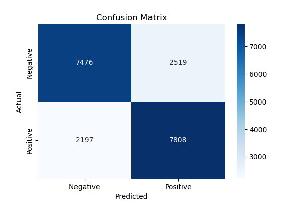

# 🐦 Social Media Sentiment Analysis

##  Project Overview
A Machine Learning project that analyzes Twitter data to classify tweets as **Positive** or **Negative** using Natural Language Processing (NLP) techniques.

##  Results
| Metric | Score |
|--------|-------|
| Accuracy | 76.42% |
| Precision | 76% |
| Recall | 76% |
| F1-Score | 76% |

##  Tech Stack
- Language: Python
- Libraries:Pandas, NumPy, NLTK, Scikit-learn, Matplotlib, Seaborn, WordCloud
- Model: Logistic Regression with TF-IDF Vectorization
- Dataset: Sentiment140 (1.6 Million Tweets)

##  Visualizations
### Sentiment Distribution

### Positive Tweets Word Cloud

### Negative Tweets Word Cloud

### Confusion Matrix

## 🔄 Project Workflow
1. Data Collection - Sentiment140 dataset (1.6M tweets)
2. Data Preprocessing - Removed URLs, mentions, hashtags, stopwords
3. EDA- Word clouds and sentiment distribution charts
4. Feature Extraction - TF-IDF Vectorization (50,000 features)
5. Model Training- Logistic Regression on 80,000 tweets
6. Evaluation - 76.42% accuracy on 20,000 test tweets

##  Sample Predictions
| Tweet | Sentiment | Confidence |
|-------|-----------|------------|
| "I love this product!" | 😊 Positive | 87.7% |
| "This is the worst experience" | 😞 Negative | 80.2% |
| "I hate Mondays" | 😞 Negative | 97.7% |
| "Best meal of my life!" | 😊 Positive | 86.3% |

## 📁 Files
- `sentiment_analysis.ipynb` - Main project notebook
- `sentiment_model.pkl` - Saved ML model
- `tfidf_vectorizer.pkl` - Saved TF-IDF vectorizer

##  Author
**Priya-0306** | [GitHub](https://github.com/Priya-0306)
